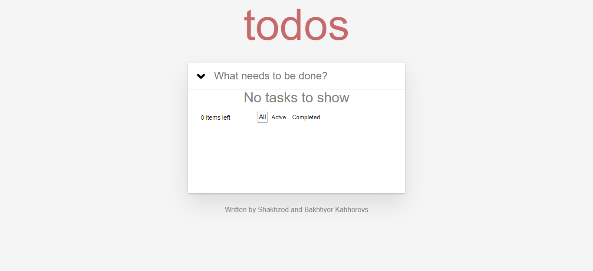
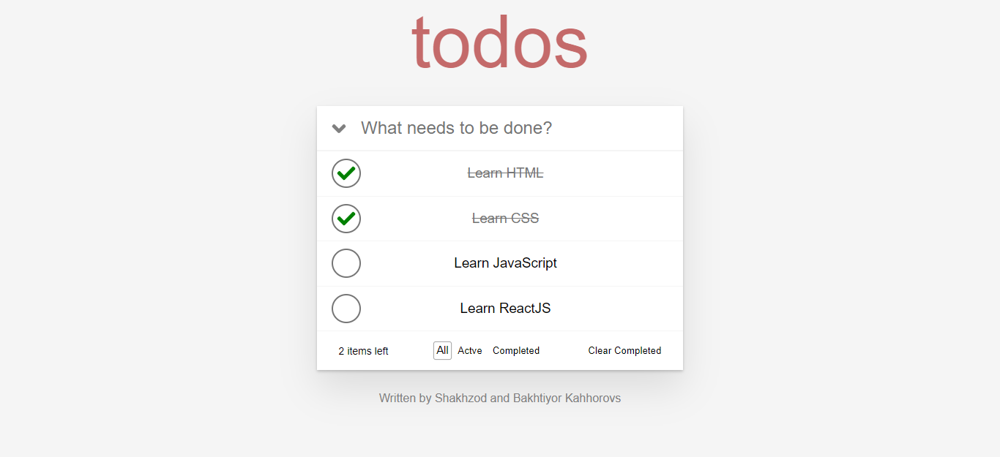
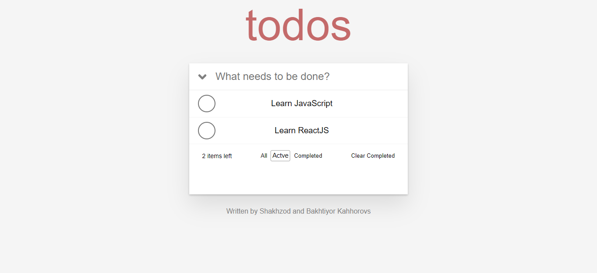
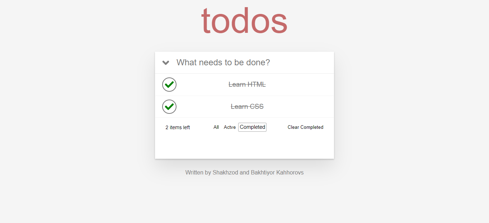

## 📝 Author

##### Shaxzod Qaxxorov <kbd>[Github](https://github.com/KahhorovSh04) / [LinkedIn](https://www.linkedin.com/in/shakhzad-kakhkhorov)  / [Telegram](https://t.me/shaxzod_qaxxorov) /  [E-Mail](mailto\:shaxzodqaxxorov04@gmail.com)</kbd>

# A Simple To Do App with facebook's React(ReactJS)

The idea is to demonstrate how to to build a To Do application with facebook's ReactJS.

# HOW TO RUN

1. Before this you will have to configure the backend API i developed with nodeJS at [https://github.com/KahhorovSh04/ReactJS-ToDo](https://github.com/KahhorovSh04/ReactJS-ToDo)
1. Clone the project from git.
1. Go to 'ReactJS-ToDo' directory.
1. Run `yarn` or `npm install`.
1. Run `npm start`.

# Preview

### Contributing

If you like the project, shoot a \:star2: and feel free to fork & send PR anytime.
